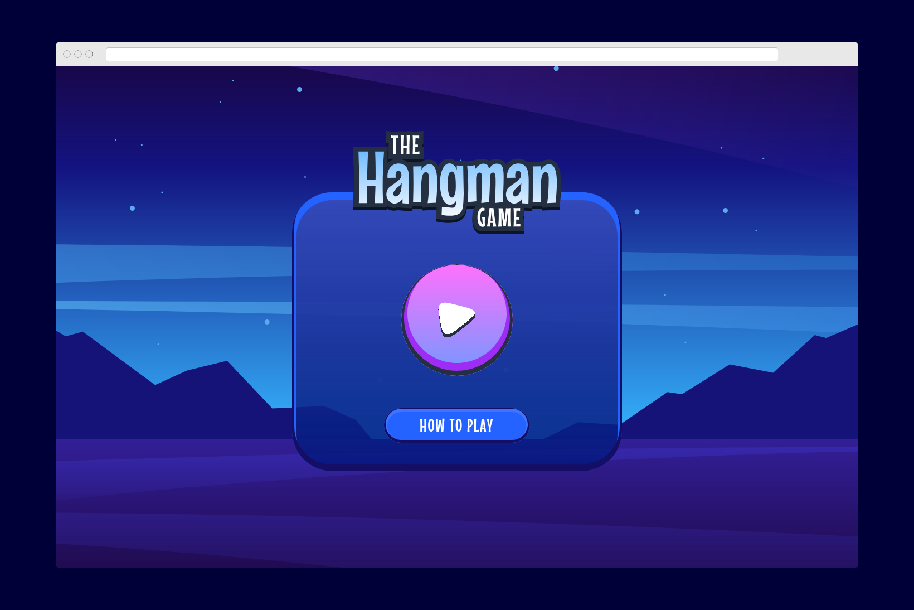
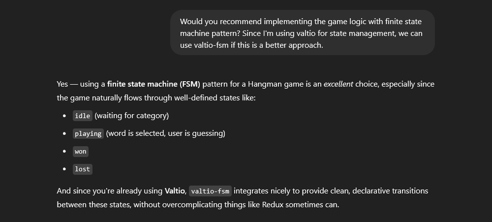

# Frontend Mentor - Hangman game solution

This is a solution to the [Hangman game challenge on Frontend Mentor](https://www.frontendmentor.io/challenges/hangman-game-rsQiSVLGWn). Frontend Mentor challenges help you improve your coding skills by building realistic projects.

## Table of contents

- [Overview](#overview)
  - [The challenge](#the-challenge)
  - [Screenshot](#screenshot)
  - [Links](#links)
- [My process](#my-process)
  - [Built with](#built-with)
  - [What I learned](#what-i-learned)
  <!-- - [Continued development](#continued-development) -->
  - [Useful resources](#useful-resources)
- [Author](#author)
- [Acknowledgments](#acknowledgments)

## Overview

### The challenge

Users should be able to:

- [x] Learn how to play Hangman from the main menu.
- [x] Start a game and choose a category.
- [x] Play Hangman with a random word selected from that category.
- [x] See their current health decrease based on incorrect letter guesses.
- [x] Win the game if they complete the whole word.
- [x] Lose the game if they make eight wrong guesses.
- [x] Pause the game and choose to continue, pick a new category, or quit.
- [x] View the optimal layout for the interface depending on their device's screen size.
- [x] See hover and focus states for all interactive elements on the page.
- [x] Navigate the entire game only using their keyboard.

### Screenshot

### Links

- Solution URL: [Add solution URL here](https://your-solution-url.com)
- Live Site URL: https://hangman-game-fem.pages.dev

## My process

### Built with

- [React](https://reactjs.org/)
- [TypeScript](https://www.typescriptlang.org/)
- [Mantine](https://mantine.dev/) - React component library
- [Valtio](https://valtio.dev/) - Proxy state management
- [Valtio FSM](https://github.com/valtiojs/valtio-fsm) - Reactive finite state machine library
- [Motion](https://motion.dev/) (formerly Framer Motion) - For animations
- [Howler.js](https://howlerjs.com/) - For sound effects
- [CSShake](https://elrumordelaluz.github.io/csshake/) - For shake effects

### What I learned

This is by far the prettiest game I've developed. Here are some of the things I've learned along the way:

- how to use Motion's `AnimatePresence` to add exit animations to components
- thinking in terms of "game UX" (vs. general website UX)
- using the finite state machine pattern for the game logic
- implementing a conditional polyfill for `Set.prototype.isSubsetOf`
- ~~vibe coding~~ pair coding with ChatGPT

Regarding that last point, I'm generally against the idea of letting AI do your coding for you, but it's actually pretty helpful for generating initial ideas and building off of those.

In my case, I didn't know where to start coding the game logic, so I asked ChatGPT about the best way to organize the logic and app state for a hangman game. It gave me a general folder structure with a `useHangman` custom hook - good enough. But then I remembered reading about **state machines** and thought it might be a good fit since the game moves through explicitly defined states (`main_menu` &rarr; `category_pick` &rarr; `playing` &rarr; `game_over`). And so this back and forth with ChatGPT helped me refine my idea into something that I could easily implement in code.

For the list of words, I initially planned to implement an API that returns a random word based on a given category. But I decided not to do it when I realized that one could simply check the Network tab in the browser devtools to cheat. 😈

<!-- ### Continued development

Use this section to outline areas that you want to continue focusing on in future projects. These could be concepts you're still not completely comfortable with or techniques you found useful that you want to refine and perfect.

**Note: Delete this note and the content within this section and replace with your own plans for continued development.** -->

### Useful resources

- [Announcing “use-sound”, a React Hook for Sound Effects](https://www.joshwcomeau.com/react/announcing-use-sound-react-hook/) - Stumbled upon this article while searching how to add sound effects. This is where I discovered [Howler](https://howlerjs.com/).
- [3 UNIQUE Health Bar Damage Taken Effects (Unity Tutorial)](https://www.youtube.com/watch?v=cR8jP8OGbhM) - This is where I got the inspiration for the health bar animation.

## Author

- Website - [Josh Javier](https://joshjavier.com/)
- Frontend Mentor - [@joshjavier](https://www.frontendmentor.io/profile/joshjavier)
- Twitter - [@joshjavierr](https://www.twitter.com/joshjavierr)
- LinkedIn - [Josh Javier](https://www.linkedin.com/in/joshjavier/)

## Acknowledgments

This is where you can give a hat tip to anyone who helped you out on this project. Perhaps you worked in a team or got some inspiration from someone else's solution. This is the perfect place to give them some credit.

**Note: Delete this note and edit this section's content as necessary. If you completed this challenge by yourself, feel free to delete this section entirely.**
